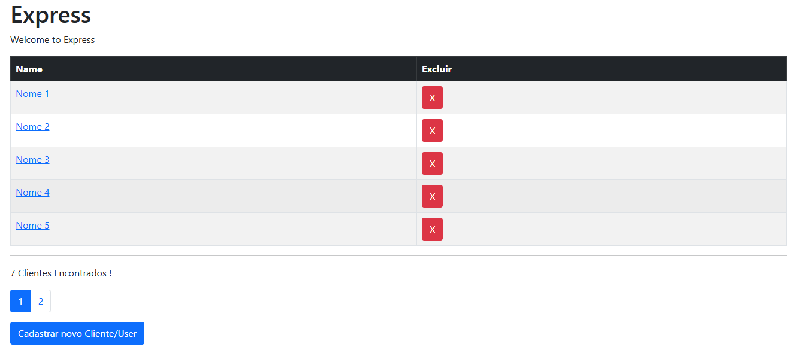
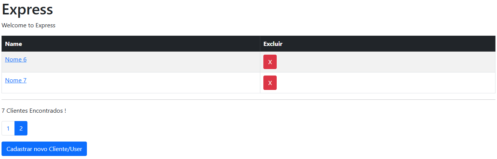

# webApp-node-mongo-ejs-bootstrap-paginacao
Web app feito em Node.js, com MongoDB como banco de dados, EJS e Bootstrap na parte visual. O projeto contém paginação.

<hr /> <br />



<hr /> <br />



<hr /> <br />

## Pré-requisitos

Antes de começar, verifique se você tem o **Node.js** instalado. Você pode verificar isso executando o seguinte comando no seu terminal:

```bash
node -v
```

## Como rodar o projeto

### 1. Clone o repositório
Primeiro, clone o repositório para o seu computador:

```bash
git clone https://link-do-repositorio.git
```

### 2. Instale as dependências

No diretório do projeto, execute o seguinte comando para instalar todas as dependências necessárias:

```bash
npm install
```
### 3. Execute o projeto

Após as dependências serem instaladas, inicie o servidor com o comando:

```bash
npm start
```
Isso vai iniciar o servidor e o projeto estará rodando localmente. Você pode acessar o projeto no navegador em http://localhost:3000 (ou outra porta configurada).